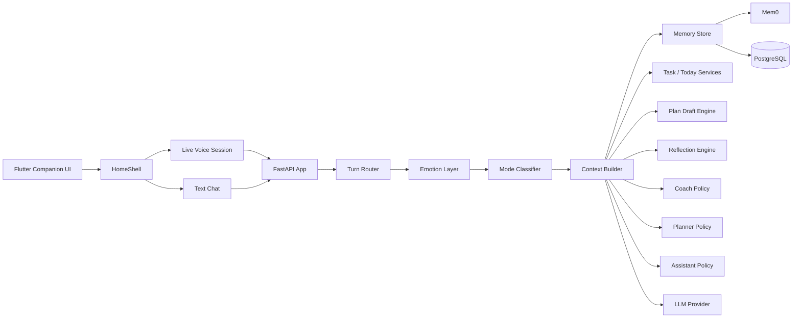

# AiPal Companion V2 Design

Status: working draft

This document turns the companion brief into an implementation plan that fits the
current AiPal codebase. It is intentionally grounded in the existing Flutter +
FastAPI app so we can evolve the product without replacing the stack.

## 1. What Exists Today

Current shipped foundations:

- Flutter mobile/web client with shared `HomeShell`
- Companion voice mode with Live Voice v2
- Text chat mode with `plan_draft` support
- Today dashboard with task scheduling and plan confirm/discard
- Notifications, Settings, onboarding, auth, and profile persistence
- PostgreSQL-backed tasks, profiles, conversation turns, live sessions, and plan drafts
- Optional mem0 integration for long-term memory search/add/delete

Relevant backend entry points:

- `apps/api/app/routers/turn.py`
- `apps/api/app/routers/ws_session.py`
- `apps/api/app/routers/profile.py`
- `apps/api/app/memory.py`
- `apps/api/app/services/conversation.py`
- `apps/api/app/services/voice_turn.py`

Relevant mobile entry points:

- `apps/mobile/lib/screens/companion_screen.dart`
- `apps/mobile/lib/screens/text_chat_screen.dart`
- `apps/mobile/lib/screens/today_screen.dart`
- `apps/mobile/lib/screens/home_shell.dart`
- `apps/mobile/lib/providers/app_state.dart`

## 2. Product Target

The product should feel like:

- Companion
- Coach
- Thinking partner
- Reflection partner
- Accountability partner

Task creation remains important, but it becomes a consequence of understanding,
not the first thing AiPal does.

## 3. Operating Modes

AiPal should route each turn into one of four modes:

- Companion Mode
- Coach Mode
- Planner Mode
- Assistant Mode

Mode selection should be automatic and based on intent, emotion, and current context.

### Mode rules

- Companion Mode: emotional sharing, venting, check-ins, reflection, rapport
- Coach Mode: stuck decisions, tradeoffs, prioritization, next-best-action advice
- Planner Mode: explicit planning, scheduling, organizing, reminders, tasks
- Assistant Mode: direct execution commands like create reminder, add task, focus session

## 4. Step 1 Foundation

Goal: add the companion intelligence layer without disturbing existing task and voice flows.

### Step 1 deliverables

- Add structured conversation context assembly
- Add emotion detection before every response
- Add memory write/read boundaries
- Add mode classification for every turn
- Add a consistent response contract for text and voice

### Step 1 inputs

- Current turn text or transcript
- Current user profile
- Current Today snapshot
- Current conversation history
- Prior memory hits
- Recent emotional state

### Step 1 outputs

- Selected mode
- Emotional state
- Response text
- Tool/action plan
- Memory write candidates
- Follow-up prompt or reflection question

## 5. Proposed Architecture



## 6. Data Model Direction

The current schema already covers profiles, tasks, sessions, plan drafts, and
conversation turns. The companion layer should add dedicated memory tables.

### Recommended additions

- `user_memories`
- `episodic_memories`
- `working_memory_snapshots`
- `emotion_observations`
- `reflection_entries`
- `goal_hierarchy`
- `goal_progress_events`
- `companion_signals`

### Suggested shape

```json
{
  "id": "uuid",
  "user_id": "uuid",
  "kind": "goal | preference | habit | relationship | project | moment",
  "title": "Launch Qring",
  "summary": "User is building Qring with a focus on estate customers",
  "importance": 10,
  "confidence": 0.86,
  "source": "conversation | profile | reflection | task | system",
  "tags": ["qring", "sales"],
  "last_seen_at": "2026-06-21T20:00:00Z",
  "created_at": "2026-06-21T20:00:00Z"
}
```

### Memory policy

- Long-term memory stores stable facts, goals, preferences, habits, and projects
- Episodic memory stores notable conversation moments and emotional events
- Working memory stores current objectives and recent turns only
- Every memory write should include confidence and provenance
- Low-confidence facts should be tagged and can decay over time

## 7. Prompt System Direction

The prompt stack should be layered:

1. Base companion identity
2. User profile and relationship context
3. Mode policy
4. Emotion state
5. Memory retrieval
6. Current task/today context
7. Conversation turn

### Prompt contract

The model should always return:

- reply text
- inferred mode
- emotional read
- memory write suggestions
- tool intent
- follow-up question if needed

## 8. Flutter Screen Direction

The app should gain companion-oriented surfaces without losing the existing
task dashboard.

### Screen map

- Companion
  - voice orb
  - status pill
  - emotional state
  - recent memory highlights
  - suggested follow-up
- Reflection
  - daily journal
  - evening recap
  - gratitude
  - lessons learned
- Memory
  - timeline
  - important moments
  - goals
  - relationship notes
- Coach
  - decision tradeoffs
  - recommended next step
  - confidence notes
- Today
  - tasks
  - goals
  - progress
  - plan drafts

## 9. API Direction

The existing API should evolve with companion-specific endpoints.

### Candidate endpoints

- `GET /api/v2/companion/context`
- `GET /api/v2/companion/memory`
- `POST /api/v2/companion/memory`
- `GET /api/v2/companion/emotions`
- `POST /api/v2/companion/emotions`
- `GET /api/v2/companion/reflections`
- `POST /api/v2/companion/reflections`
- `GET /api/v2/goals`
- `POST /api/v2/goals`
- `PATCH /api/v2/goals/{id}`
- `POST /api/v2/goals/{id}/progress`

## 10. Step-by-Step Roadmap

### Step 1

Foundation:

- mode router
- emotion layer
- structured context builder
- memory write/read policy
- turn response contract

### Step 2

Memory system:

- PostgreSQL companion tables
- mem0 write/read integration
- episodic memory capture
- profile engine synthesis

### Step 3

Reflection system:

- evening prompts
- weekly summaries
- journal storage
- insight extraction

### Step 4

Goal system:

- goal tree
- milestone progress
- task linkage
- proactive check-ins

### Step 5

UI expansion:

- memory timeline
- reflection screens
- mood state display
- goal progress visualization

### Step 6

Production hardening:

- retention rules
- privacy controls
- memory deletion
- observability
- prompt regression tests

## 11. Immediate Next Implementation Step

The next code change should be the backend context/mode layer:

- create a `companion_context.py` service
- create a `turn_mode.py` classifier
- make text and voice turns call that service before the LLM
- store emotion and memory metadata per turn
- keep the current task/plan flows intact

