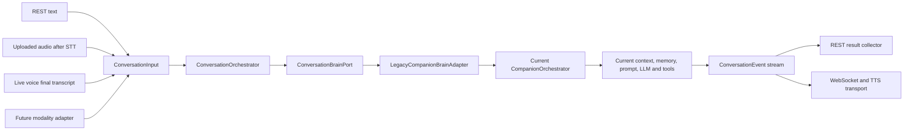
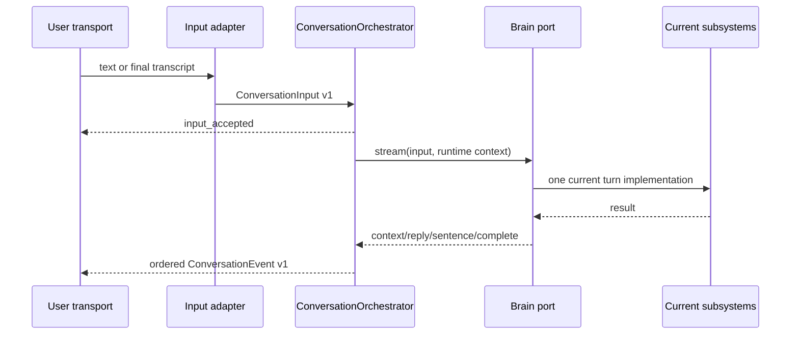
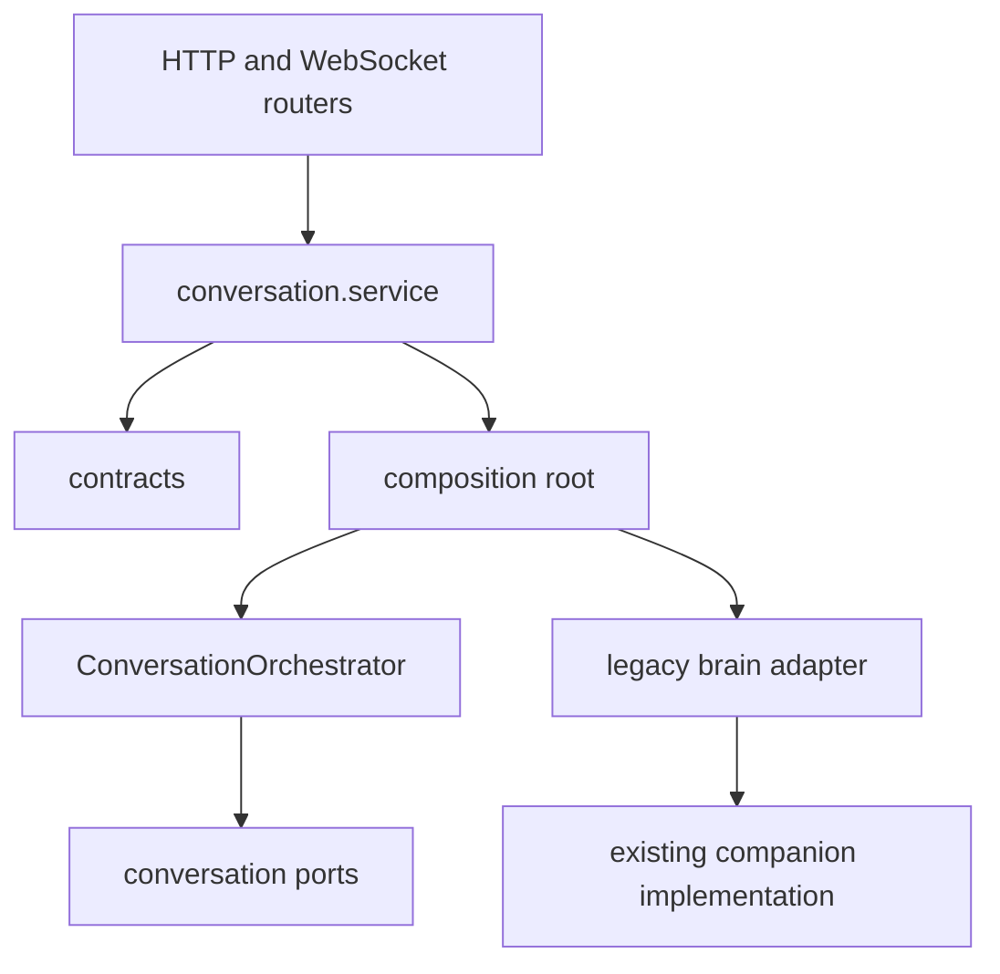
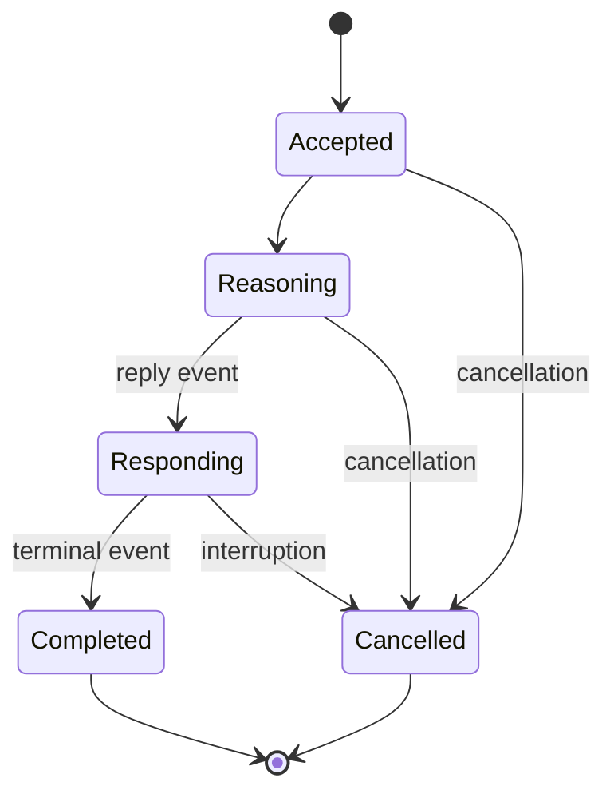

# Phase 1: Unified Conversation Architecture

Status: implemented. This document describes the Phase 1 boundary only. The
state, voice, turn-detection, memory, prompt, reasoning, tool, and true-streaming
internals remain compatibility implementations until their approved phases.

## Component flow

## Turn sequence

## Dependency rule

Routers may authenticate, validate, rate-limit, transcribe, synthesize, and map
wire formats. They may not select prompts, memory, planners, tools, or LLMs.

## State machine

## Contract guarantees

- Every input has schema, input, turn, user, conversation, modality, and time metadata.
- Every event has a unique ID, ordered sequence, correlation/causation IDs, and transient/durable classification.
- Authenticated user identity is checked at the orchestration boundary.
- REST collection consumes the same event stream used by live transports.
- Cancellation is checked before execution and between emitted events.
- Free-form language cannot invoke the compatibility tool router by keyword;
  explicit trusted UI tool context remains supported.
