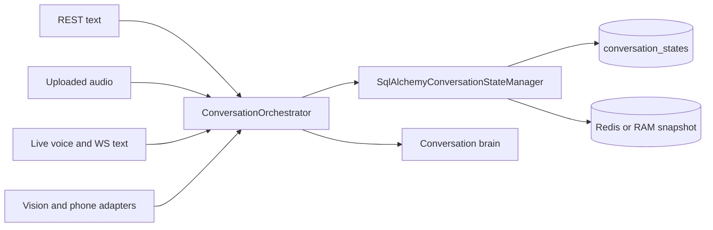
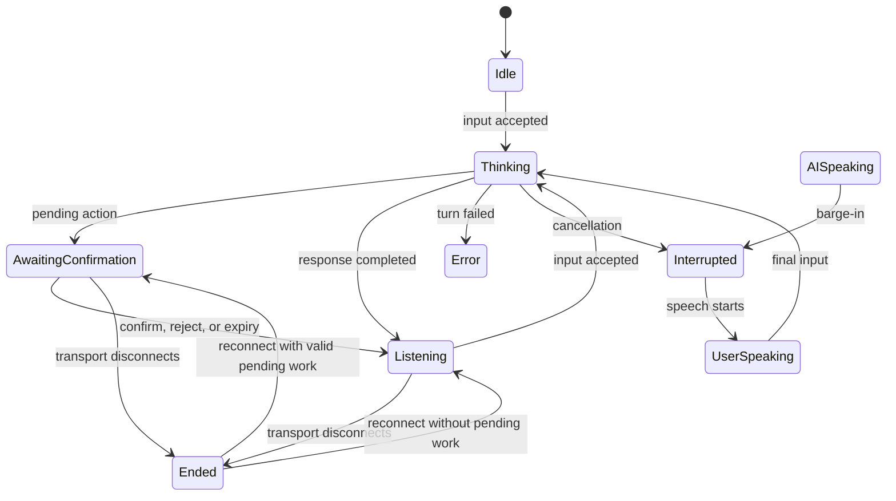
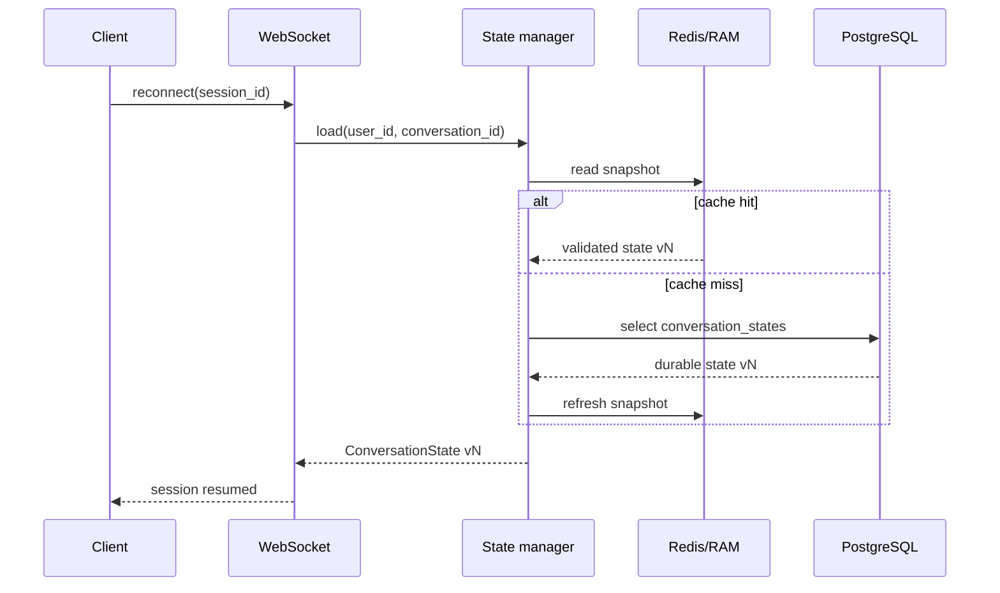

# Phase 2: Canonical Conversation State

Phase 2 replaces the former voice-only, cache-only dictionary with one typed
state document for every modality. PostgreSQL is the durable source of truth;
Redis, or the bounded in-process fallback, stores an expiring read snapshot.

## Ownership

`conversation_states` is the only active conversation-state source. The
`conversations` row remains conversation history metadata, and `live_sessions`
remains transport-session metadata.

## Lifecycle

## State contract

The state always has structural fields for topic, goal, pending action,
confirmation, emotion, active project, people, tools, rolling conversation
summary, last interruption, last AI response, user intent, mode, active turn,
speaker information, transcript information, metadata, version, and timestamps.

Unknown domain values remain `null` or empty rather than being invented.
Structured context supplied by a trusted caller can populate goal, project, and
people references. Later reasoning phases can enrich these same fields without
introducing another state store.

## Mutation semantics

- Omitted patch field: preserve the current value.
- Explicit `null`: clear a nullable field.
- Every successful mutation increments `version`.
- SQL updates compare the prior version and retry non-explicit conflicts.
- Explicit stale versions raise `ConversationStateConflictError`.
- Pending actions expire after 30 minutes by default and are cleared on load.
- A confirmation cannot exist without its pending action.
- Completing a non-confirmation turn clears both pending fields.
- Ending a transport session clears the active turn and speaker, but preserves
  valid pending work so reconnects cannot silently discard user decisions.
- Resuming restores the pending workflow state, or returns to `listening` when
  no valid pending work remains.

## Reconnect flow

