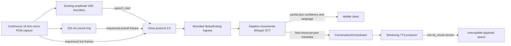
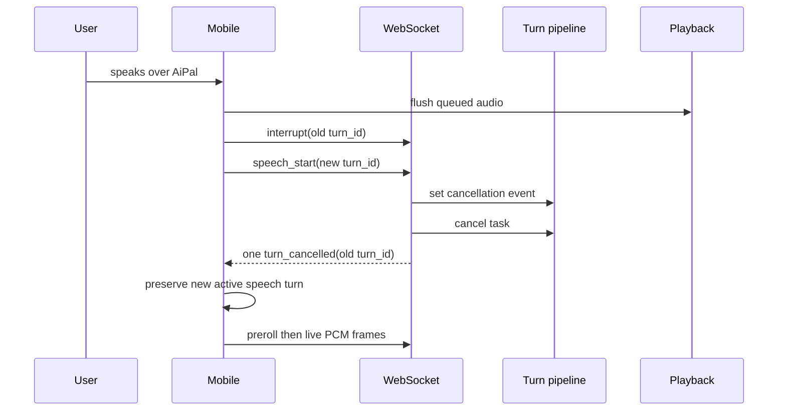

# Phase 3: Production Voice Pipeline

Phase 3 keeps microphone capture continuous while a live session is active and
uses one versioned WebSocket protocol for ordered PCM ingress, incremental STT,
turn cancellation, and TTS delivery. It does not introduce a second AI brain:
final transcripts still enter the canonical `ConversationOrchestrator`.

> Phase 4 supersedes the client-owned preroll and amplitude endpoint boundary:
> PCM now streams continuously and the server retains preroll while neural VAD
> owns speech boundaries. This document remains the Phase 3 implementation record.

## Data flow

## Protocol invariants

- Protocol version: `3.0`.
- Audio: signed PCM16 little-endian, 16 kHz, mono, 40 ms client frames.
- Every utterance has one `turn_id` and monotonically increasing frame sequence.
- Duplicate or out-of-order frame sequences are discarded before STT.
- A frame is capped at 64 KiB and an utterance at 30 seconds of PCM.
- Partial and final transcript events identify finality and expose confidence,
  language, language confidence, and accumulated audio duration when available.
- Each synthesized audio payload is sent once as `tts_chunk`; the former mirrored
  `audio_chunk` event is not emitted.

## Interruption and cancellation

Late TTS chunks for a cancelled turn are ignored by the client. Cancellation
acknowledgements are correlated to the old turn and cannot clear a new user turn.

## Buffering and latency

- The client retains 320 ms of PCM before speech detection to protect initial
  phonemes and short words.
- Endpoint silence remains adaptive between 700 and 1,400 ms for Phase 3.
- Partial STT snapshots run eagerly for the first two seconds, at the configured
  interval through six seconds, then back off to reduce CPU contention.
- Synchronous Whisper inference is protected by a process-wide thread lock so
  cancelled worker threads cannot create overlapping model execution.

## Phase 4 boundary

The existing amplitude/timer VAD still decides `speech_start` and `speech_end`.
Neural VAD, semantic endpointing, transcript-completion signals, and contextual
pause interpretation are deliberately deferred to Phase 4.
