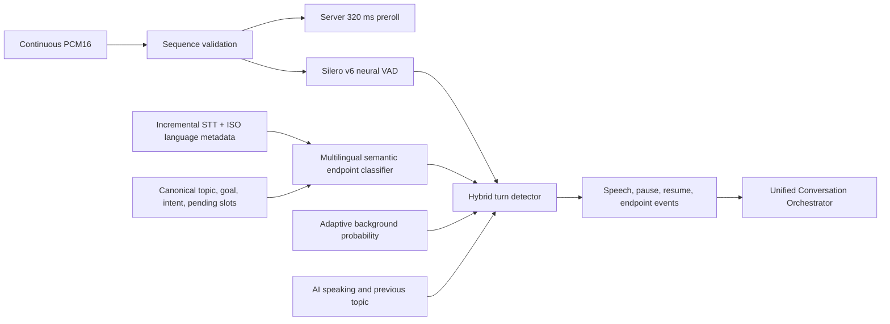
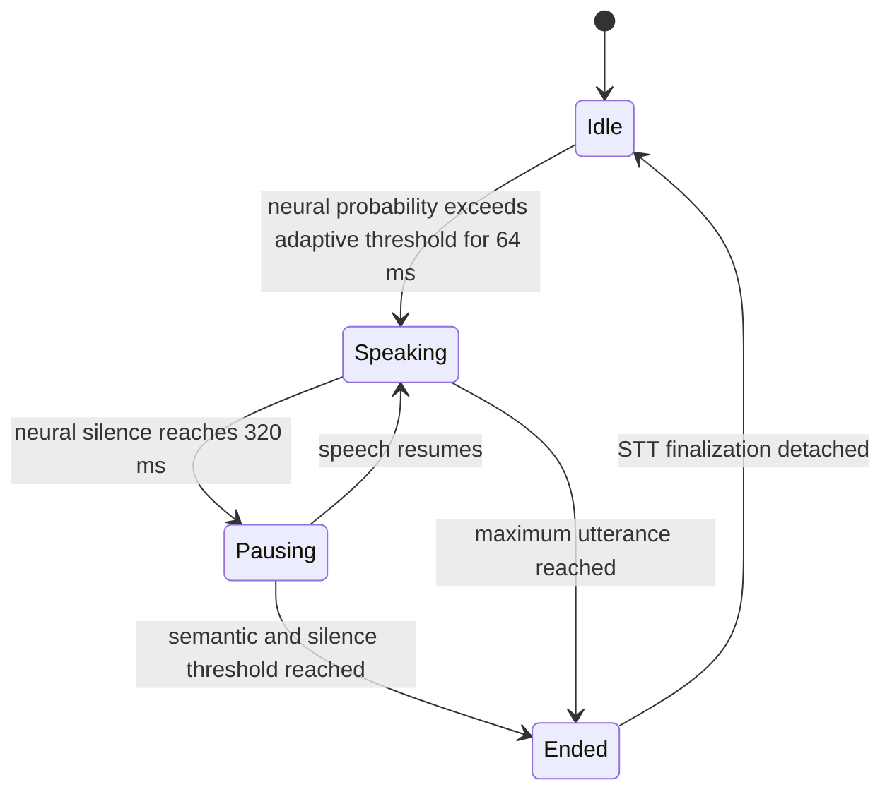
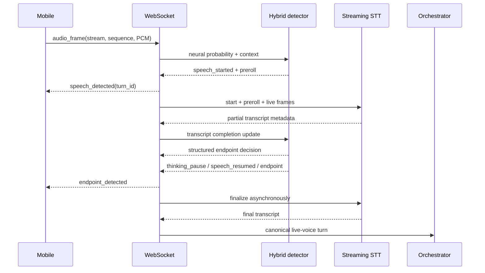

# Phase 4: Neural and Semantic Turn Detection

Phase 4 makes the server authoritative for live-voice speech boundaries. The
mobile recorder sends continuous, sequenced PCM under voice protocol `4.0`.
Mobile amplitude monitoring is no longer allowed to start or finish a turn; it
is retained only as an immediate local TTS-flush hint during barge-in.

## Detection pipeline

Silero v6 is loaded from Faster-Whisper's bundled ONNX asset. Initialization is
performed outside the event loop. If ONNX initialization fails, a calibrated
energy probability provider is activated and disclosed in the session handshake.

## State machine

## Endpoint fusion

The active provider is `multilingual_semantic_local`. It uses the quantized ONNX
export of `sentence-transformers/paraphrase-multilingual-MiniLM-L12-v2` through
FastEmbed (384 dimensions, approximately 0.22 GB, CPU). The model is downloaded
at deployment and preloaded at application startup. The calibrated local head
compares an utterance embedding with language-neutral completion states; it is
not trained from per-language command dictionaries.

The classifier result is fused with:

- multilingual semantic similarity between current and recent partials;
- transcript growth, recent-token stability, and structural open/closed state;
- canonical topic, goal, current intent, pending action, and missing slots;
- STT confidence and partial-hypothesis stability;
- the change ratio between recent partial hypotheses;
- list, thinking, correction, confirmation, and required-slot state;
- neural silence duration;
- the deterministic maximum utterance duration.

The structured result contains `continue_listening`, `likely_complete`,
`force_complete`, or `uncertain`, plus confidence, reason, completion
probability, required slots, provider, classifier latency, and a recommended
wait. Complete short commands can close after 240 ms. Stable complete turns
normally close after 440–600 ms. Incomplete or unstable turns receive up to
1,400 ms. A 20-second maximum bounds pathological segments independently of
semantic classification.

Provider language and probability flow through every partial and final STT
contract. Missing metadata is `unknown`, never `en`. A monotonic partial
sequence prevents delayed hypotheses or language updates from overwriting newer
state. Multiple provider languages observed during one turn set
`code_switching_detected`; a language change alone cannot complete the turn.
Because Faster-Whisper commonly labels Nigerian Pidgin as English, a documented
small high-specificity Pidgin marker fallback may add `pcm` to the language set;
it does not decide semantic completion.

`linguistic_endpoint_fallback` remains an explicit deterministic failure mode.
Model exceptions and inference beyond 20 ms produce `uncertain` with a 900 ms
wait and a disclosed fallback reason. Production `fail_closed` startup rejects
an unavailable model or active fallback. The handshake/capabilities response
exposes provider, model, version, source, size, device, tested languages,
latencies, and fallback state without exposing the cache path.

The neural start threshold adapts above persistent background speech probability.
The end threshold adapts separately with hysteresis so ambient sound does not
rapidly toggle the detector.

## Context classification

- `thinking`: silence occurred but the turn remains open.
- `finished`: completion and silence jointly ended the turn.
- `interrupted`: speech began while AiPal generation or playback was active.
- `topic_change`: the completed transcript has very low lexical overlap with the
  prior canonical topic and contains enough evidence for comparison.

These classifications are metadata for the unified brain; they do not route to
separate assistants or execute tools.

## Event sequence

STT finalization and downstream AI work run in tracked tasks, allowing the socket
to continue receiving PCM and detect the next user turn. Task exceptions are
retrieved and logged instead of becoming unobserved background failures.

## Runtime evidence

The endpoint decision is included in thinking-pause, endpoint, final transcript,
and privacy-safe STT metric payloads. The 300-scenario generated/degraded
transcript corpus contains 100 English/Nigerian English, 100 Nigerian Pidgin or
mixed, and 100 French cases. Each tested language measured 0% false cutoffs,
0% over-waits, 440 ms complete-turn median, 700 ms complete-turn p95, and
240 ms short-command median. Classifier inference measured 3.710 ms median and
4.859 ms p95 on the development host. These are automated fixture results, not
physical-device or staging-provider evidence. French was selected because the
active Faster-Whisper and MiniLM models both have reliable French coverage.

Only `en`, `pcm`, and `fr` are verified in this corpus. Every other language is
reported as `language-agnostic fallback active`; equivalent accuracy is not
claimed. Physical-device multilingual, echo, Bluetooth, background-noise, and
staging-provider latency validation remain release requirements.

## Memory boundary

The detector consumes canonical conversation state but does not perform memory,
calendar, task, project, or people retrieval. Those remain responsibilities of
the unified context and memory layers, keeping endpoint inference bounded.

## Workstream 4 acoustic contract

The detector now emits a canonical acoustic decision alongside the unchanged
semantic endpoint decision. Silero remains authoritative for speech start/end
and barge-in. Per-session lifecycle, readiness, diagnostics, contextual pause
behavior, and verification boundaries are documented in
`docs/architecture/conversation-neural-vad.md`. This consumes existing semantic
and canonical conversation state without changing topic policy.
