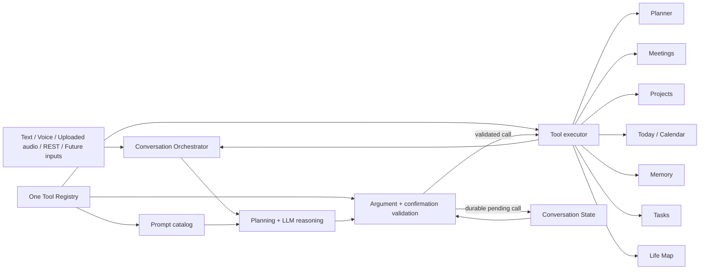
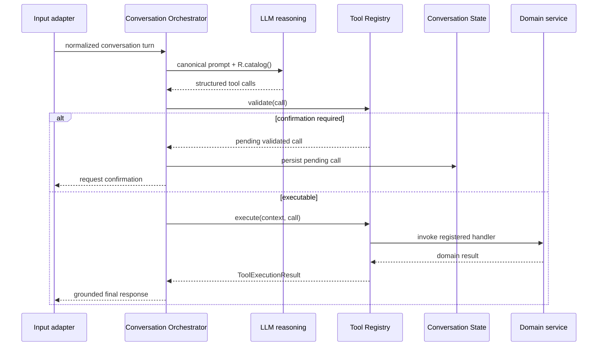
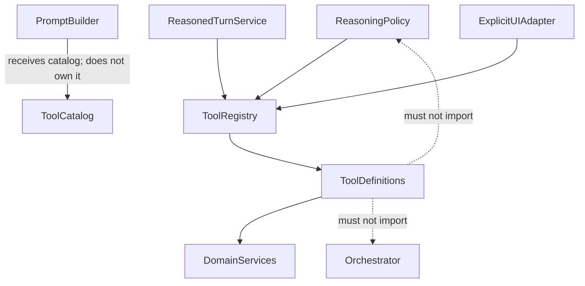

# Phase 8 — Unified Tool Registry

Status: approved and complete. Phase 9 has not started.

## Decision

AiPal has one authoritative `ToolRegistry`. A tool is registered once with its canonical name, aliases, argument contract, confirmation policy, and asynchronous handler. The same registry metadata drives the reasoning prompt, backend validation, pending-confirmation policy, and execution.

Transport adapters never select implementation code. Text, voice, uploaded audio, REST conversation turns, and future inputs submit a normalized turn to the Conversation Orchestrator. The orchestrator's reasoning loop produces structured calls, and `ToolRegistry.execute` is the only conversational capability execution boundary.

Direct CRUD APIs remain deterministic application APIs; they are not conversational reasoning paths. They continue to call domain services after authentication and validation.

## Architecture

## Tool contract

Each definition owns:

- canonical name and unique aliases;
- human-readable description used in the canonical prompt;
- a strict Pydantic argument model (`extra="forbid"`);
- a backend confirmation predicate for mutations;
- one asynchronous handler accepting `ToolExecutionContext` and validated arguments.

`ToolExecutionContext` carries only authenticated runtime dependencies: database session, authenticated user, current message, output narration preference, and source metadata. User identity is never accepted as a model-supplied tool argument.

`ToolExecutionResult` is the common result envelope. It records the canonical tool, action, validated result data, fallback narration, optional draft, and any next confirmation. Transport-specific presentation is added after execution, never inside routing.

## Execution sequence

## Dependency rule

There is no tool-name `if`/`switch` router. Adding a future tool requires one registration plus its handler and tests; no prompt, validation, or orchestration edits are permitted.

## Confirmation and failure policy

- The registry's backend predicate overrides an LLM claim that confirmation is unnecessary.
- A mutating call is persisted as a validated pending call before execution.
- Confirmation executes exactly the persisted call; model-supplied replacement arguments are ignored.
- Planner draft creation is read/propose. Applying the draft is a separate mutating planner action and must match durable confirmation.
- Calls execute in declared dependency order. An error stops dependent calls and is returned as bounded failure evidence.
- Unknown tools, aliases in model output, extra fields, malformed UUID/date values, oversized strings, and oversized payloads fail before a handler runs.

## Non-functional requirements

- Registry lookup and argument validation p95: under 10 ms locally.
- Registry orchestration overhead, excluding domain I/O: under 30 ms p95.
- Structured logs include tool, call ID, status, duration, and failure class; arguments and memory contents are not logged.
- Cancellation is checked between calls and propagates into the active handler task.
- Registrations and aliases are immutable after startup and duplicate registration fails fast.

## Rollout

1. Introduce the registry beside the compatibility router.
2. Make prompt catalog and reasoning validation consume registry metadata.
3. Move all capability handlers and planner confirmation into registered handlers.
4. Reduce the compatibility router to alias resolution, registry execution, and optional narration.
5. Prove text, voice, explicit UI, and reasoning calls reach the same executor in integration tests.
6. Remove duplicated catalogs and fail CI if a conversational tool bypass returns.

Rollback is code-only: the registry preserves current response envelopes and domain-service calls, so no data migration is required.

## Production readiness evidence

### Files changed

- `apps/api/app/services/tool_registry.py` — authoritative immutable registry, typed contracts, confirmation policies, handlers, and execution telemetry.
- `apps/api/app/services/tool_router.py` — thin explicit-UI compatibility adapter; no capability switch.
- `apps/api/app/services/reasoning_policy.py` — registry-backed argument and confirmation validation.
- `apps/api/app/services/ai_reasoning_engine.py` — prompt catalog generated from registry metadata.
- `apps/api/app/services/reasoned_turn_service.py` — all structured calls, including planner confirmation, execute through the registry.
- `apps/api/app/services/prompt_builder.py` and `companion_response_service.py` — removed the competing tool list and inject the registry catalog into the one prompt.
- `apps/api/app/services/companion_orchestrator.py` and `conversation_manager.py` — legacy planner confirmation adapters now use the same executor.
- `apps/api/app/conversation/ports.py` — execution port aligned with authenticated execution context.
- `apps/api/tests/test_tool_registry_phase8.py` — contract, integration, confirmation, load, latency, and anti-bypass coverage.
- This document — architecture, rollout, and production evidence.

### Review results

- Implementation review: complete; eight existing conversational capabilities are registered once.
- Code review: complete; no unresolved findings, no tool-name switch, no duplicate prompt or policy catalog, and no private planner-confirmation execution in conversation paths.
- Integration review: complete; authenticated text, voice, and explicit UI requests were observed calling the same `ToolRegistry.execute` method.
- Architecture review: complete; prompt, validation, confirmation, and execution all depend on registry metadata in one direction.
- Edge-case review: complete; unknown tools, aliases, cross-user fields, extra arguments, malformed UUID/date values, oversized values, duplicate registrations, forged confirmation, missing records, empty results, handler failure, and concurrent context isolation are covered.
- Security review: model arguments cannot supply user identity; domain queries remain scoped to the authenticated user; mutating explicit calls fail closed into durable confirmation.

### Verification

- Phase 8 focused suite: 11 passed.
- Phase 1–8 focused regression: 75 passed.
- Full API regression after final review: 270 passed, 1 environment-gated skip.
- Focused post-review integration/regression: 30 passed.
- Flutter regression: 13 passed.
- Flutter static analysis: no issues.
- Python Ruff review of all Phase 8 integration files: clean.
- Python compilation and import smoke: clean.
- Diff whitespace/error check: clean.
- Concurrent load smoke: 250 isolated executions completed without context leakage.

Measured over 5,000 local iterations:

- registry lookup plus validation p95: 0.0090 ms (budget: 10 ms);
- registry execution overhead p95, excluding domain I/O: 0.0127 ms (budget: 30 ms).

### Manual verification

The authenticated local API was exercised for the following paths and the returned tool evidence/state transitions were inspected:

1. Text task request → structured reasoning → registry → grounded final response.
2. Voice task request → the identical registry executor with `source=voice`.
3. Explicit task UI context → alias/argument validation → the identical executor.
4. Explicit project-room creation → no handler execution → durable pending tool call.
5. Confirmed project-room call → execution only from the persisted call.
6. Planner draft → review state → confirmed apply through the planner registry handler.
7. Invalid meeting UUID and cross-user argument → handler not invoked.

### Remaining risks and limitations

- Domain-service latency (LLM, database, embedding provider) is measured by its own phase and is intentionally excluded from registry overhead.
- The one skipped full-suite test is the existing environment-gated PostgreSQL integration; Phase 8's registry suite has no skips.
- Direct authenticated CRUD endpoints remain deterministic application APIs by architectural decision. They are not alternate conversation brains or conversational tool routes.
- Provider-token and incremental TTS response streaming remain Phase 9 scope and were not changed here.

### Regression checklist

- [x] One authoritative catalog
- [x] One execution path for text, voice, and explicit UI
- [x] Planner draft application uses registry execution
- [x] Backend confirmation cannot be weakened by model output
- [x] Durable pending calls survive the orchestration boundary
- [x] Tool arguments are strictly typed and bounded
- [x] Authenticated user scope cannot be overridden by arguments
- [x] Ordered multi-tool execution and failure stop remain intact
- [x] Prompt tool list matches executable tools
- [x] No duplicated tool router or keyword capability routing introduced
- [x] Unit, integration, load, latency, mobile, and regression checks pass

Production readiness: **approved**. Phase 8 is closed; work may move to Phase 9 only on a new explicit request.
