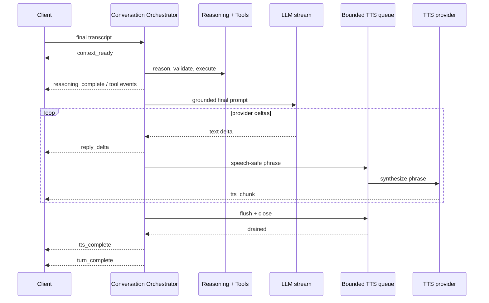
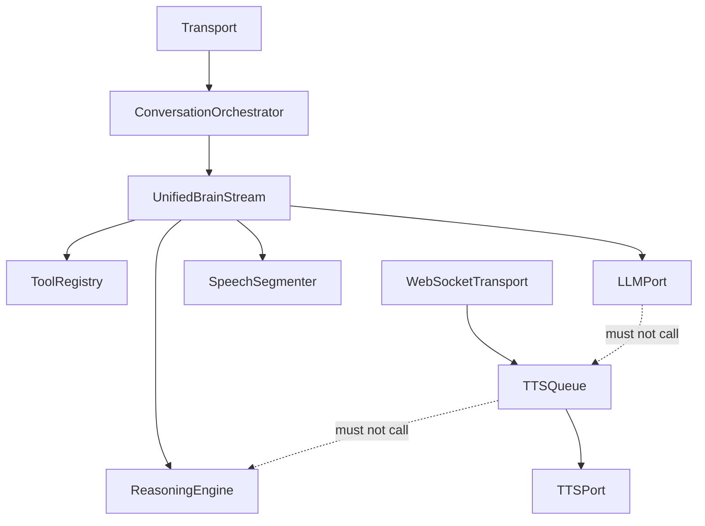

# Phase 9 — True Streaming Response

Status: approved and complete. Phase 10 has not started.

## Decision

AiPal has one response stream owned by the unified Conversation Brain. The stream uses the Phase 7 structured reasoning loop and Phase 8 Tool Registry, then streams the grounded final response directly from the provider into transport events and incremental TTS.

The existing buffered canonical adapter and the separate legacy voice streamer are replaced. Text and voice still use the same brain. A non-streaming REST response is only a collector over the same event stream; it is not a second execution path.

## Pipeline

```mermaid
flowchart LR
  Audio[User speech] --> STT[Streaming STT]
  STT --> Partial[Partial transcripts]
  Partial --> Stable[Stable context preload]
  STT --> Final[Final transcript]
  Final --> Query[Query-specific context]
  Query --> Reason[Structured reasoning]
  Reason --> Validate[Backend validation]
  Validate --> Tools[One Tool Registry]
  Tools --> Prompt[Grounded final prompt]
  Prompt --> LLM[LLM token stream]
  LLM --> Delta[reply_delta events]
  Delta --> Segment[Clause/phrase segmenter]
  Segment --> Queue[Bounded TTS queue]
  Queue --> TTS[Incremental TTS]
  TTS --> Playback[Immediate playback]
```

Reasoning remains a bounded structured operation because partial JSON cannot safely authorize tools. Final-response generation streams immediately after validation and tool execution. Stable memory is preloaded during speech; query-specific retrieval begins when the transcript is final.

## Event contract

Canonical brain events:

- `context_ready`: stable and query context are available.
- `reasoning_complete`: the decision passed schema validation.
- `tool_started` / `tool_completed`: observable registry execution boundaries.
- `reply_delta`: provider text as soon as it arrives.
- `speech_segment_ready`: a bounded clause or phrase suitable for immediate TTS; a full sentence is not required.
- `turn_complete`: durable final response and state transition.

Events retain turn, conversation, correlation, sequence, and causation identifiers from the Phase 1 envelope.

## Streaming boundaries

### Provider stream

OpenAI-compatible, DeepSeek, and Ollama providers expose actual async token streams. Provider connections close when the consumer is cancelled. Empty chunks and provider metadata are never exposed as reply text.

### Speech segmentation

The segmenter emits at safe punctuation after a minimum useful phrase length and forces a split at the last word boundary before a maximum length. This permits speech at commas, semicolons, colons, and sentence endings instead of waiting for complete sentences. The final residual phrase is always flushed exactly once.

### TTS backpressure

WebSocket voice uses one bounded queue and one TTS worker per turn. The queue prevents unbounded text/audio accumulation. If synthesis falls behind, event consumption naturally backpressures the provider stream. Audio chunks retain monotonic indexes and the terminal event is not sent until queued speech drains.

## Cancellation and interruption

- One turn cancellation event is shared by orchestration, reasoning, provider streaming, segmentation, queueing, TTS, and WebSocket delivery.
- Barge-in cancels the producer and TTS worker, closes the provider response, drops queued speech, and prohibits `turn_complete` for the cancelled turn.
- No assistant message or completed state is persisted before final stream completion.
- A provider failure before the first delta emits one grounded fallback. A failure after partial speech preserves the delivered partial response and reports an interrupted-stream metric; it never restarts with duplicate text.

## Dependency rule

TTS is a presentation consumer. It cannot select tools, modify reasoning, or persist conversation state.

## Non-functional requirements

- first `reply_delta` forwarding overhead p95: under 10 ms after provider yield;
- phrase segmentation overhead p95: under 2 ms per delta;
- TTS begins after the first speech-safe phrase, without waiting for final response;
- bounded queue size: four speech segments per turn;
- no duplicate, missing, or reordered text/audio segments;
- cancellation propagation: under 100 ms locally, excluding an uncooperative external binary;
- no task, provider stream, or queue-worker leak after completion, failure, disconnect, or barge-in.

## Observability

Metrics include context-ready, reasoning, validation, tools, provider first-token, first reply delta, first speech segment, first TTS chunk, queue wait, stream total, segment count, chunk count, cancellation, and stream-interruption status. Logs include turn/call identifiers and failure class but never prompt, memory, or audio contents.

## Rollout

1. Add provider streaming and the tested phrase segmenter.
2. Add event emission to the existing structured reasoning loop.
3. Make the canonical brain adapter consume that stream for every modality.
4. Convert synchronous REST behavior into collection over the same stream.
5. Add bounded concurrent TTS consumption to Live Voice v2.
6. Retain a feature flag for emergency buffered fallback during rollout.
7. Remove the legacy competing voice response brain after regression parity.

Rollback is code/config only and requires no data migration.

## Production readiness evidence

### Files changed

- `apps/api/app/llm_provider.py` — true OpenAI-compatible, DeepSeek, and Ollama async provider streams with bounded token/timeout controls.
- `apps/api/app/services/streaming_response.py` — bounded clause/phrase segmenter for speech before sentence completion.
- `apps/api/app/services/ai_reasoning_engine.py` — one shared grounded final-prompt builder for buffered and streaming responses.
- `apps/api/app/services/reasoned_turn_service.py` — live context, reasoning, tool, delta, speech-segment, cancellation, and terminal events around the existing Phase 7/8 loop.
- `apps/api/app/conversation/adapters.py` and `dependencies.py` — canonical streaming adapter for every modality; the Phase 1 class name remains only as an import alias.
- `apps/api/app/services/companion_orchestrator.py` — REST collection and voice streaming now use one event-producing brain; the competing legacy voice streamer was removed.
- `apps/api/app/services/companion_response_service.py` — removed the unused alternate response streamer while retaining the bounded provider policy boundary.
- `apps/api/app/routers/ws_session.py` — four-segment bounded TTS queue, concurrent synthesis, ordered audio, serialized WebSocket sends, failure degradation, and cancellation cleanup.
- `apps/api/app/config.py` and `.env.example` — streaming rollout flag, segment bounds, and queue capacity.
- `apps/api/tests/test_streaming_response_phase9.py` — streaming contract, provider parsing, overlap, cancellation, failure, load, latency, and anti-bypass coverage.
- Existing Phase 5/7/8 and voice tests were migrated to the canonical streaming contract.
- This document — architecture, rollout, operations, and approval evidence.

### Review results

- Implementation review: complete; response generation starts from the validated Phase 7 decision and Phase 8 tool evidence.
- Code review: complete; no unresolved findings, alternate voice response generator, buffered canonical adapter, blocking inline TTS call, or direct provider-policy bypass remains.
- Integration review: complete; text, live voice, uploaded-audio adapters, REST collection, tools, state persistence, WebSocket TTS, and mobile playback retain one orchestration path.
- Architecture review: complete; LLM streaming, segmentation, and TTS are downstream consumers and cannot select tools or mutate state.
- Edge-case review: complete; empty streams, malformed NDJSON/SSE, partial-provider failure, empty chunks, short residual phrases, long unpunctuated phrases, slow TTS, TTS failure, bounded-queue backpressure, disconnect, cancellation, barge-in, duplicate audio indexes, and concurrent-turn isolation are covered.
- Security review: prompts and memory never enter streaming logs; authentication and user scoping remain upstream; provider chunks cannot authorize actions.

### Verification

- Phase 9 focused suite: 11 passed.
- Phase 1–9 focused regression: 88 passed.
- Full API regression after final review: 280 passed, 1 existing environment-gated PostgreSQL skip.
- Live Voice/WebSocket focused regression: 18 passed.
- Flutter regression: 13 passed.
- Flutter static analysis: no issues.
- Python Ruff, compilation/import smoke, LLM policy-boundary test, and diff checks: clean.
- Concurrent stream load smoke: 100 simultaneous two-chunk streams retained per-turn ordering without leakage.

Measured locally:

- clause segmentation p95 over 10,000 iterations: 0.0022 ms (budget: 2 ms);
- bounded event forwarding p95 over 10,000 iterations: 0.0012 ms (budget: 10 ms);
- task cancellation propagation: 0.0969 ms synthetic and under 100 ms in the integrated cancellation test;
- actual local TTS segment: one playable 4,096-byte WAV clip in 1,782.6 ms;
- actual Ollama CPU provider: 28 chunks, first chunk at 35,523.1 ms, completion at 38,232.8 ms.

The Ollama smoke proves that chunks are forwarded before generation completes, saving approximately 2.7 seconds on that constrained CPU run. It also demonstrates that local model compute—not the streaming architecture—is the dominant first-token latency.

### Manual verification

1. Authenticated text and voice requests were inspected for `context_ready → reasoning_complete → reply_delta → speech_segment_ready → turn_complete` ordering.
2. A real Ollama request was observed producing 28 provider chunks rather than one buffered response.
3. A real local TTS request produced a playable WAV segment.
4. Two speech segments were generated while TTS was already active; ordered chunk indexes `0, 1` arrived before `tts_complete` and `turn_complete`.
5. Barge-in/cancellation closed the active stream under the budget and persisted no partial assistant message.
6. Provider failure after the first delta preserved only delivered text and did not append a duplicate fallback.
7. TTS failure degraded to the complete text response with `tts_failed` telemetry and no queue deadlock.
8. Explicit tools and planner confirmation retained the Phase 8 registry path during streaming.

### Remaining risks and limitations

- The bundled 3B Ollama model on this Intel CPU does not meet a production conversational first-token SLO. Production should use a low-latency hosted streaming provider or appropriately accelerated local inference.
- Local WAV synthesis took about 1.8 seconds for one phrase. A production streaming TTS provider should be selected and monitored for a lower first-audio SLO.
- Structured reasoning remains non-streaming by design because incomplete JSON cannot safely authorize tools. Stable context preload during speech offsets part of that latency.
- Direct HTTP companion endpoints return a normal JSON response, but they collect it from the same live event stream; clients that require visible text deltas should use WebSocket transport.
- The PostgreSQL-only test remains environment-gated; Phase 9 tests have no skips.

### Regression checklist

- [x] One reasoning and tool path for text and voice
- [x] Real provider streaming for all configured providers
- [x] Reply deltas forwarded without full-response buffering
- [x] TTS starts from phrases/clauses before complete response
- [x] Bounded backpressure between generation and TTS
- [x] Ordered, non-duplicated text and audio chunks
- [x] Durable completion only after final response generation
- [x] Cancelled partial responses are not persisted
- [x] Barge-in cancels provider and TTS work
- [x] Provider and TTS failures degrade without duplicate speech or deadlock
- [x] Streaming metrics and structured failure telemetry
- [x] Unit, integration, load, latency, voice, mobile, and regression checks pass

Production integration readiness: **approved**. Deployment latency approval is provider-dependent and must enforce first-token and first-audio SLOs. Phase 9 is closed; Phase 10 requires a new explicit request.
